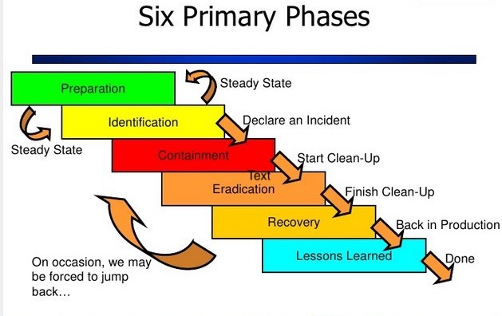
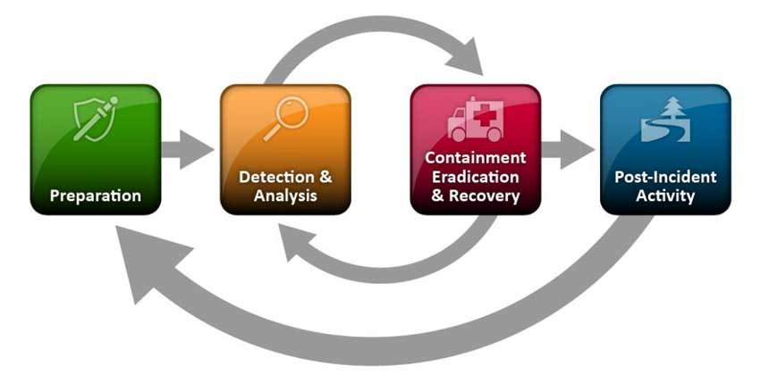
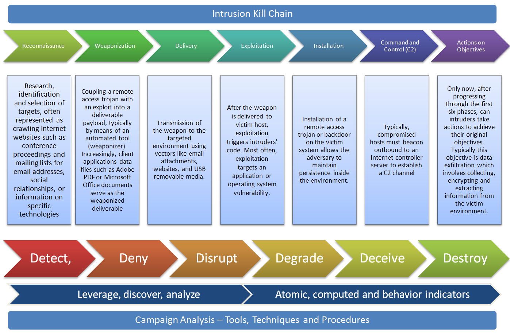
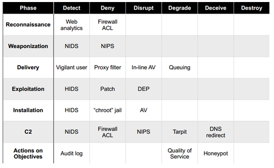
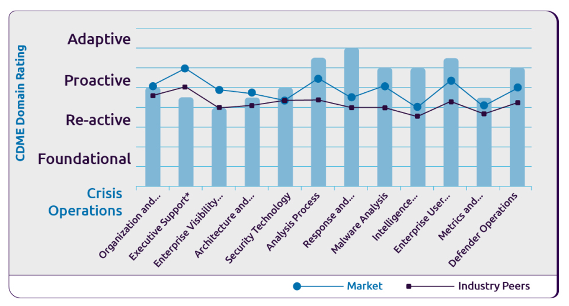
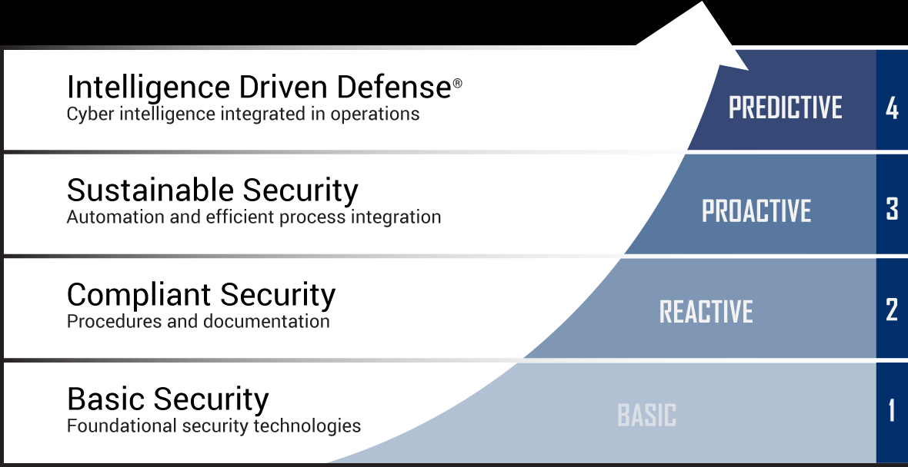

# Detection Engineering Reference

Frameworks, tools and ideas I find useful for detection engineering.

## Frameworks

### Incident Response Plan

[SANS](docs/sans-incident-handlers-handbook.pd) outlines the 6 phases to an incident in order to create a incident response plan.

### Incident Response Lifecycle

[NIST](docs/nist-incident-response-lifecycle.pdf) outlines the 4 phases to an incident.

### Cyber Kill Chain

[Lockheed Martin](docs/LM-White-Paper-Intel-Driven-Defense.pdf) breaks down an intrusion into 7 well-defined phases, and can help identify patterns that link individual intrusions into broader campaigns. The 7 phases cover all of the stages of a single intrusion that — when completed successfully — lead to a compromise.

* Clearly defined linear sequence of phases (as opposed to ATT&CK).
* `Reconnaissance` and `Weaponization` are often ignored but can be valuable.

#### Courses of Action Matrix

Part of the Cyber Kill Chain. Defenders can measure the performance as well as the effectiveness of these actions, and plan investment roadmaps to rectify any capability gaps

* Can be an useful tool in evaluating capabilities and gaps.

### Pyramid of Pain

[David J Bianco](https://detect-respond.blogspot.com/2013/03/the-pyramid-of-pain.html) shows the relationship between the types of indicators you might use to detect an adversary's activities and how much pain it will cause them when you are able to deny those indicators to them.

* Pain is a two-way street for both the adversary and analyst. For the analyst, hash detections (atomic) are _trivial_ to write, and TTP detections (behavioral) are _tough_ to write.
* Atomic may offer higher confidence than behavioral detections, but behavioral detections offer more longevity.
* Useful to keep in mind when prioritizing detection rules.

### 1-10-60 Rule
[CrowdStrike](https://www.crowdstrike.com/blog/first-ever-adversary-ranking-in-2019-global-threat-report-highlights-the-importance-of-speed/) investigated, the average “breakout time” in 2017 was one hour and 58 minutes. Breakout time indicates how long it takes for an intruder to jump off the initial system (“beachhead”) they have compromised and move laterally to other machines within the network.

* 1 minute to detect, 10 minutes to investigate and 60 minutes to remediate.
* Useful to keep in mind when discussing ingest lag, working hours, and on-call.

### Cybersecurity Defense Maturity Scorecard

[Not-Sure-Who-Invented-This](Scorecard_Cybersecurity-Defense-Maturity-Evaluation.pdf) defines cybersecurity maturity across key domains.

* Decent tool for board maturity assessment

### ATT&CK

## Notes

* Building a detection program from scratch
  * Evaluate the maturity and size of the company
  * Atomic vs Behavior indicators - behavior has a longer ramp up time but offers better security.

• Atomic - Atomic indicators are those which cannot be broken down into smaller parts and retain their meaning in the context of an intrusion. Typical examples here are IP addresses, email addresses, and vulnerability identifiers.
• Computed - Computed indicators are those which are derived from data involved in an incident. Common computed indicators include hash values and regular expressions.
• Behavioral - Behavioral indicators are collections of computed and atomic indicators, often subject to qualification by quantity and possibly combinatorial logic. An example would be a statement such as ”the intruder would initially used a backdoor which generated network traffic matching [regular expression] at the rate of [some frequency] to [some IP address], and then replace it with one matching the MD5 hash [value] once access was established.”
