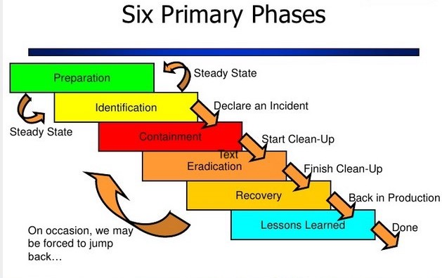
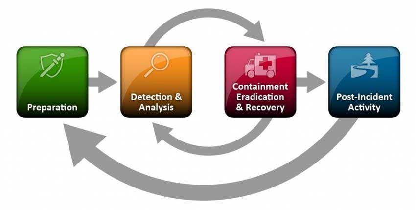
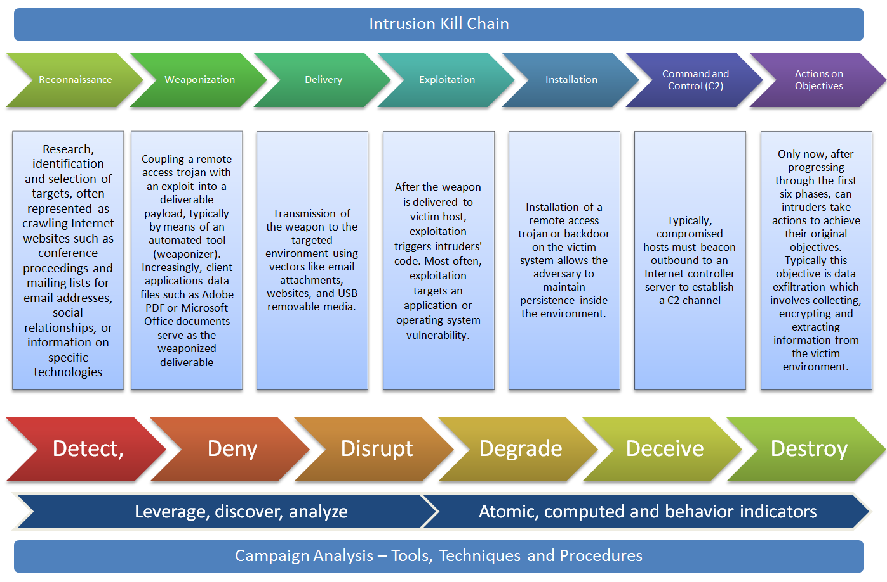
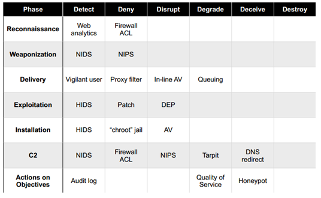
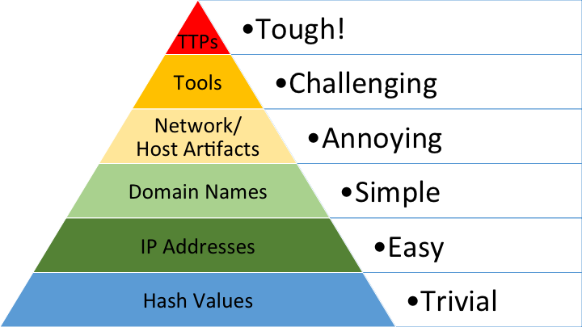
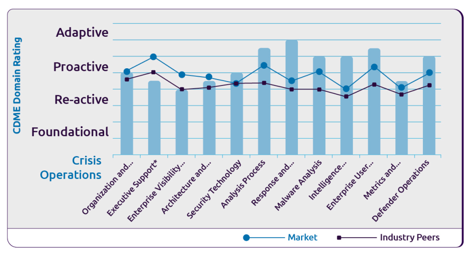
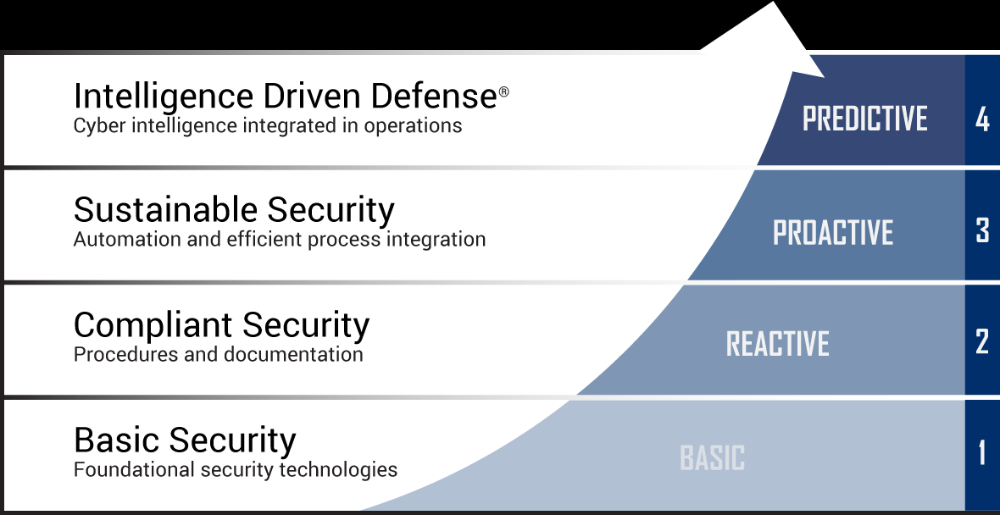
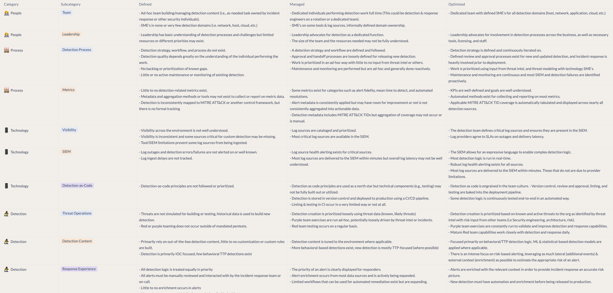
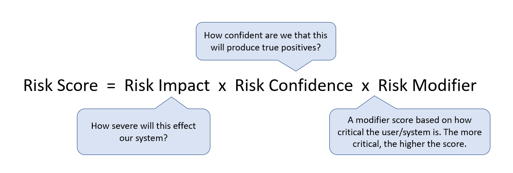

# Threat Detection Engineering Reference

> A curated, opinionated reference of the frameworks, tools, and resources that matter most in **threat detection engineering and incident response** — distilled into one page you can actually skim.

**Who this is for:** detection engineers, SOC analysts, threat hunters, and security leaders who want a fast mental map of the field — the core frameworks (Kill Chain, ATT&CK, Pyramid of Pain), the detection-as-code ecosystem, ready-to-use detection rule sources, and the best external references — without wading through a dozen blog posts.

⭐ **Find this useful? Star the repo to bookmark it and help others discover it.** Contributions welcome — see [Contributing](#contributing).

## Table of Contents

* [Frameworks](#frameworks)
  * [Incident Response Lifecycle](#incident-response-lifecycle)
  * [Cyber Kill Chain](#cyber-kill-chain)
    * [Courses of Action Matrix](#courses-of-action-matrix)
  * [Pyramid of Pain](#pyramid-of-pain)
  * [1-10-60 Rule](#1-10-60-rule)
  * [Cybersecurity Defense Maturity Scorecard](#cybersecurity-defense-maturity-scorecard)
  * [Detection Engineering Maturity Matrix](#detection-engineering-maturity-matrix)
  * [ATT&CK](#attck)
  * [DeTT&CT](#dettct)
  * [Detections-as-Code (DaC)](#detections-as-code-dac)
  * [Distributed Alerting (DA)](#distributed-alerting-da)
  * [Risk-Based Alerting (RBA)](#risk-based-alerting-rba)
  * [Purple Teaming](#purple-teaming)
  * [Data Science](#data-science)
  * [Threat Modeling](#threat-modeling)
  * [Threat Intelligence](#threat-intelligence)
* [Detection Rules / Signatures](#detection-rules--signatures)
* [Resources](#resources)
* [Notes](#notes)
* [Contributing](#contributing)

## Frameworks

### Incident Response Lifecycle

[SANS](docs/sans-incident-handlers-handbook.pdf) outlines the 6 incident phases.

[NIST](docs/nist-incident-response-lifecycle.pdf) outlines 4 phases.

### Cyber Kill Chain

[Lockheed Martin](docs/LM-White-Paper-Intel-Driven-Defense.pdf) breaks down an intrusion into 7 well-defined phases, and can help identify patterns that link individual intrusions into broader campaigns. The 7 phases cover all of the stages of a single intrusion that — when completed successfully — leads to a compromise.

* Clearly defined linear sequence of phases (as opposed to ATT&CK).
* `Reconnaissance` and `Weaponization` are often ignored but can be valuable.

#### Courses of Action Matrix

Part of the Cyber Kill Chain. Defenders can measure the performance as well as the effectiveness of these actions, and plan investment roadmaps to rectify any capability gaps

* Valuable tool in evaluating capabilities and gaps.

### Pyramid of Pain

[David J Bianco](https://detect-respond.blogspot.com/2013/03/the-pyramid-of-pain.html) shows the relationship between the types of indicators you might use to detect an adversary's activities and how much pain it will cause them when you are able to deny those indicators to them.

* Pain is a two-way street for both the adversary and analyst. For the analyst, hash detections (atomic) are _trivial_ to write, and TTP detections (behavioral) are _tough_ to write.
* Atomic may offer higher confidence than behavioral detections, but behavioral detections offer more longevity.
* Useful to keep in mind when prioritizing detection rules.

### 1-10-60 Rule

[CrowdStrike](https://www.crowdstrike.com/blog/first-ever-adversary-ranking-in-2019-global-threat-report-highlights-the-importance-of-speed/) investigated, the average “breakout time” in 2017 was one hour and 58 minutes. Breakout time indicates how long it takes for an intruder to jump off the initial system (“beachhead”) they have compromised and move laterally to other machines within the network.

* 1 minute to detect, 10 minutes to investigate and 60 minutes to remediate.
* Useful to keep in mind when discussing ingest lag, working hours, and on-call.

### Cybersecurity Defense Maturity Scorecard

[Not-Sure-Who-Invented-This](docs/Scorecard_Cybersecurity-Defense-Maturity-Evaluation.pdf) defines cybersecurity maturity across key domains.

* Decent tool for board maturity assessment

### Detection Engineering Maturity Matrix

* [Github](https://github.com/k-bailey/detection-engineering-maturity-matrix) & [detectionengineering.io](https://detectionengineering.io)
* [Article](https://kyle-bailey.medium.com/detection-engineering-maturity-matrix-f4f3181a5cc7) and [SANS Blue Team Summit Talk](https://www.youtube.com/watch?v=Dxccs8UDu6w&list=PLs4eo9Tja8biPeb2Wmf2H6-1US5zFjIxW&index=11)
* Converted to [Google Sheets](https://docs.google.com/spreadsheets/d/13hKfYXk1t1tfzsz59GsIOAcWen4QakUgj1OznZz-eHE/edit?usp=sharing)

### ATT&CK

[MITRE](https://attack.mitre.org/) ATT&CK is a globally-accessible knowledge base of adversary tactics and techniques based on real-world observations. Enough has been written on this.

### DeTT&CT

[Rabobank CDC](https://github.com/rabobank-cdc/DeTTECT) DeTT&CT aims to assist blue teams in using ATT&CK to score and compare data log source quality, visibility coverage, detection coverage, and threat actor behaviors.

### Detections-as-Code (DaC)

The principle of infrastructure-as-code but for detections. This allows you to version control detections and apply the same CI/CD principles to your detections as you do to your infrastructure.

* [Splunk](https://www.splunk.com/en_us/blog/security/ci-cd-detection-engineering-splunk-security-content-part-1.html) has a open-source project called [Splunk Security Content](https://github.com/splunk/security_content)
- Elastic has this open-source project called [Detection Rules for Elastic Security](https://github.com/elastic/detection-rules)
* Carta released their own tool called [Krang](https://github.com/carta/krang)

### Distributed Alerting (DA)

Popularized by Slack in this [blog post](https://slack.engineering/distributed-security-alerting/). The concept is to shift the burden of alert triage from Analyst to the relevant teams. Additional verification can be accomplished with 2FA.

* Great for misconfiguration-type alerts e.g. internet exposed server, compliance requirements, RBAC.

### Risk-Based Alerting (RBA)

Risk-based alerting (RBA) provides teams with a unique opportunity to pivot resources from traditionally reactive functions to proactive functions in the SOC. Detections are tagged with observations and metadata to produce a score. Alerts are then correlated by some grouping e.g. user, IP, source, then fired if the correlated risk is above a certain score.

* [Splunk article](https://www.splunk.com/en_us/blog/security/risk-based-alerting-the-new-frontier-for-siem.html)
* [Video](https://conf.splunk.com/files/2018/recordings/say-goodbye-to-your-sec1479.mp4)

### Purple Teaming

Purple teaming to create/inspire detections.

* Tool [atomic-red-team](https://github.com/redcanaryco/atomic-red-team)
* Tool [stratus-red-team](https://github.com/DataDog/stratus-red-team)

### Data Science

* Conference talk by [Strip](https://www.youtube.com/watch?v=-9BfXMYn0wk)

### Threat Modeling

Threat modeling works to identify, communicate, and understand threats and mitigations within the context of protecting something of value.

* Article [owasp](https://owasp.org/www-community/Threat_Modeling)
* [Threat Modeling Manifesto](https://www.threatmodelingmanifesto.org/) - Values and principles for effective threat modeling.

### Threat Intelligence

Threat intelligence is data that is collected, processed, and analyzed to understand a threat actor’s motives, targets, and attack behaviors. Threat intelligence enables us to make faster, more informed, data-backed security decisions and change their behavior from reactive to proactive in the fight against threat actors.

* Article by [crowdstrike](https://www.crowdstrike.com/cybersecurity-101/threat-intelligence/)

## Detection Rules / Signatures

* [SigmaHQ](https://github.com/SigmaHQ/sigma/tree/master/rules)
* [Mitre](https://car.mitre.org/analytics/)
* [Splunk](https://github.com/splunk/security_content)
* [Elastic](https://github.com/elastic/detection-rules/tree/main/rules)
* [Datadoghq](https://docs.datadoghq.com/security_platform/default_rules/)
* [Streamalert](https://github.com/airbnb/streamalert/tree/master/rules/community)
* [Azure](https://github.com/Azure/Azure-Sentinel/tree/master/Solutions)
* [Okta](https://sec.okta.com/shareddetections)
* MacOS [LooBins macOS Binaries](https://www.loobins.io/)

## Resources

### Detection Engineering

* [Detection Engineering Weekly](https://www.detectionengineering.net/) - Zack Allen's newsletter (16k+ subscribers) curating the week's top detection engineering content, tools, and research. The best single way to stay current.
* [Detection Engineering Maturity Matrix](https://detectionengineering.io/) - Kyle Bailey's matrix for measuring and benchmarking your detection function across people, process, and technology.
* [Awesome Detection Engineering](https://github.com/infosecB/awesome-detection-engineering) - Community-curated master list of DE tools, blogs, and references.
* [Awesome Detection Rules](https://github.com/jatrost/awesome-detection-rules) - Aggregated collection of open-source detection rule repos across SIEM/EDR platforms.
* [Florian Roth's Blog](https://cyb3rops.medium.com/) - Deep, practical writing on detection rule quality, Sigma, and YARA from the creator of Sigma.
* [Security Engineering Study Notes](https://github.com/gracenolan/Notes/blob/master/interview-study-notes-for-security-engineering.md) - Excellent prep notes covering detection/security engineering fundamentals.
* [scrty.io](https://scrty.io/) - Curated security engineering reference and reading.
* [The DFIR Report](https://thedfirreport.com/) - Real-world intrusion reports with the TTPs, artifacts, and detections you can turn into rules.

### Threat Intelligence / Lookup (IP, URL, Domain, File)

* [Cisco Talos Reputation Center](https://talosintelligence.com/reputation_center) - IP/domain reputation and email/web traffic insights.
* [VirusTotal](https://www.virustotal.com/) - Multi-engine file, URL, domain, and IP analysis.
* [urlscan.io](https://urlscan.io/) - Sandbox that records everything a URL does (requests, screenshots, DOM).
* [Cloudflare Radar URL Scanner](https://radar.cloudflare.com/scan) - Free URL scanner with screenshots and tech detection.
* [DomainTools Whois](https://whois.domaintools.com/) - Whois and domain registration lookups for enrichment/pivoting.
* [MaxMind GeoIP](https://www.maxmind.com/en/geoip-databases) - IP geolocation and ASN databases for enrichment.
* [AbuseIPDB](https://www.abuseipdb.com/) - Crowd-sourced IP abuse reporting and reputation checks.
* [GreyNoise](https://viz.greynoise.io/) - Tells you which IPs are mass-scanning the internet vs. targeting you, great for alert noise reduction.
* [Shodan](https://www.shodan.io/) - Search engine for internet-exposed hosts and services.

### Mappings & Knowledge Bases

* [MITRE ATT&CK Navigator](https://mitre-attack.github.io/attack-navigator/) - Visualize and annotate ATT&CK coverage layers.
* [LOLBAS](https://lolbas-project.github.io/) - Living-off-the-land binaries, scripts, and libraries abused on Windows.
* [GTFOBins](https://gtfobins.github.io/) - Unix binaries that can be abused to bypass local security restrictions.
* [LOOBins](https://www.loobins.io/) - Living-off-the-land binaries for macOS.

### OSINT

* [OSINT4all (start.me)](https://start.me/p/L1rEYQ/osint4all) - Large curated OSINT tooling dashboard.
* [OSINT Framework](https://osintframework.com/) - Tree of OSINT resources organized by data type.

## Notes

* Indicator types
  * Atomic - Atomic indicators are those which cannot be broken down into smaller parts and retain their meaning in the context of an intrusion. Typical examples here are IP addresses, email addresses, and vulnerability identifiers.
  * Computed - Computed indicators are those which are derived from data involved in an incident. Common computed indicators include hash values and regular expressions.
  * Behavioral - Behavioral indicators are collections of computed and atomic indicators, often subject to qualification by quantity and possibly combinatorial logic. An example would be a statement such as ”the intruder would initially use a backdoor which generated network traffic matching [regular expression] at the rate of [some frequency] to [some IP address], and then replace it with one matching the MD5 hash [value] once access was established.”

## Contributing

Contributions are welcome and encouraged — this list gets better with more eyes on it.

* Found a broken link, typo, or outdated resource? Open an [issue](https://github.com/erickatwork/threat-detection-engineering-reference/issues) or a pull request.
* Want to add a framework, tool, or resource? Open a PR. Please keep entries concise, include a link, and add a one-line note on *why* it's useful (not just *what* it is).
* Keep formatting consistent with the existing sections and place new entries under the most relevant heading.

See [CONTRIBUTING.md](CONTRIBUTING.md) for details. If this reference saved you time, please ⭐ the repo so others can find it.
